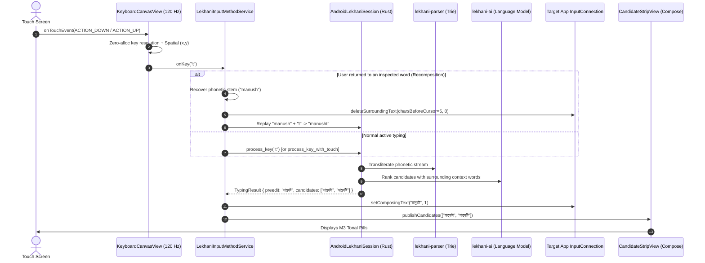
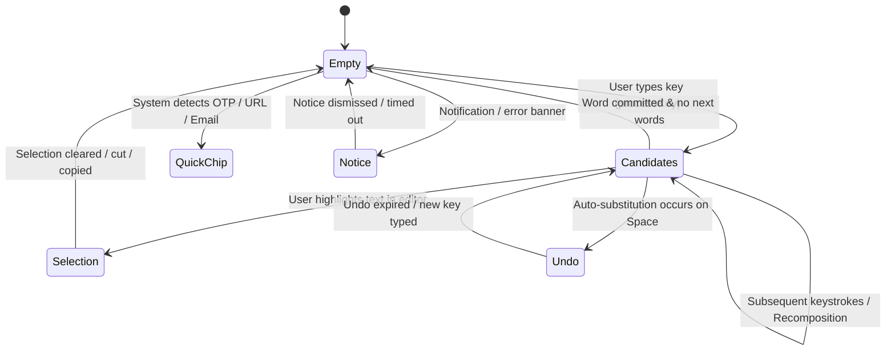

# Lekhani Android: System Architecture & Technical Specifications

> **Notice**: This document provides an exhaustive, authoritative blueprint of the Lekhani Android architecture, data flows, state machines, platform quirks, and component boundaries. Any agent or human contributor working on the codebase should read this document first.

---

## 1. System Overview & Three-Tier Architecture

Lekhani Android is built on a high-performance **Three-Tier Architecture** that cleanly isolates hardware rendering, platform IPC, native FFI boundaries, and linguistic logic:

```
┌─────────────────────────────────────────────────────────────────────────────────┐
│                    TIER 3: ANDROID NATIVE LAYER (KOTLIN 2.0)                    │
│                                                                                 │
│   ┌─────────────────────────────────────────────────────────────────────────┐   │
│   │                 LekhaniInputMethodService (IME Lifecycle)               │   │
│   │  - Shadow Preedit Buffer     - Avro Word State Recovery & Recomposition │   │
│   │  - Contextual AI Coordinator - Suggestion Chaining Controller           │   │
│   └──────────────────────┬───────────────────────────┬──────────────────────┘   │
│                          │                           │                          │
│   ┌──────────────────────▼───────┐   ┌───────────────▼──────────────────────┐   │
│   │  KeyboardCanvasView (120 FPS)│   │  CandidateStripView (Compose M3)     │   │
│   │  - Hardware Canvas Drawing   │   │  - CandidateStripState Machine       │   │
│   │  - Zero-Allocation Touch Loop│   │  - M3 Tonal Pills & Chroma Effects   │   │
│   │  - Spatial Touch Matrix (x,y)│   │  - Homophone Badges & Quick Chips    │   │
│   └──────────────────────────────┘   └──────────────────────────────────────┘   │
└──────────────────────────────────────▲──────────────────────────────────────────┘
                                       │ UniFFI Auto-Generated Kotlin Bindings
                                       │ (C-ABI / JNA)
┌──────────────────────────────────────▼──────────────────────────────────────────┐
│                   TIER 2: NATIVE FFI BRIDGE (RUST / CARGO-NDK)                  │
│                                                                                 │
│   ┌─────────────────────────────────────────────────────────────────────────┐   │
│   │                      AndroidLekhaniSession (Thread-Safe)                │   │
│   │  - Layout Switcher (Avro, Probaho, National, Gboard, English)           │   │
│   │  - Composing Buffer & Context Scorer Synchronization                    │   │
│   │  - Glide Decoding & Spatial Probability Matrices                        │   │
│   └──────────────────────────────────┬──────────────────────────────────────┘   │
└──────────────────────────────────────┼──────────────────────────────────────────┘
                                       │ Static Linking & Pure Rust Crates
┌──────────────────────────────────────▼──────────────────────────────────────────┐
│                 TIER 1: UPSTREAM ENGINE CRATES (PURE RUST 2021)                 │
│                                                                                 │
│   ┌───────────────────────┐ ┌───────────────────────┐ ┌─────────────────────┐   │
│   │     lekhani-parser    │ │      lekhani-ai       │ │     lekhani-core    │   │
│   │  - Zero-Alloc Grammar │ │  - 4-Gram Language    │ │  - Headless State   │   │
│   │  - Avro Radix Trie    │ │    Model (bengali_lm) │ │    Machine          │   │
│   │  - 11 ns/char Parsing │ │  - Bidirectional AI   │ │  - Trie Dictionary  │   │
│   │  - Sound-Law Engine   │ │    Context Scorer     │ │  - Autocorrect &    │   │
│   │                       │ │  - Next-Word Predictor│ │    Morphology       │   │
│   └───────────────────────┘ └───────────────────────┘ └─────────────────────┘   │
└─────────────────────────────────────────────────────────────────────────────────┘
```

---

## 2. Component Taxonomy & Directory Map

| Directory / File | Tier | Responsibility |
| :--- | :--- | :--- |
| `android/app/.../ime/LekhaniInputMethodService.kt` | Tier 3 | **Central IME Coordinator**: Handles Android `InputConnection`, cursor tracking, state synchronization, recomposition, and gesture actions. |
| `android/app/.../canvas/KeyboardCanvasView.kt` | Tier 3 | **Hardware Rendering Engine**: 120 FPS custom hardware Canvas view with pre-allocated object pools, multi-touch pointer tracking, and key geometry. |
| `android/app/.../ui/candidate/CandidateStripView.kt` | Tier 3 | **M3 Expressive Suggestion Bar**: Renders candidate pills, English previews, homophone badges (`HomophoneAnnotator`), undo chips, and tool vault icons. |
| `android/app/.../data/avro/AvroWordHistory.kt` | Tier 3 | **Exact Input LRU Cache**: Stores mapping from committed Bengali words to exact raw Avro inputs (`"মানুষ" → "manush"`). |
| `android/app/.../data/avro/AvroReverseTransliterator.kt` | Tier 3 | **Deterministic Reverse Transliteration**: Converts arbitrary Bengali Unicode text back to canonical Avro phonetic input on-the-fly. |
| `android/app/.../data/settings/KeyboardPreferences.kt` | Tier 3 | **Preferences Registry**: Device-protected storage manager for theme, height, haptics, Avro strip ordering, and features. |
| `crates/lekhani-android/src/session.rs` | Tier 2 | **Native Session Bridge**: Thread-safe native wrapper around `lekhani-core`, `lekhani-ai`, and `lekhani-parser`. |
| `crates/lekhani-android/src/spatial.rs` | Tier 2 | **Gaussian Spatial Model**: Computes touch log-probabilities across key boundaries for fuzzy autocorrect. |
| `lekhani-parser` | Tier 1 | **Phonetic Grammar Engine**: Zero-allocation Avro parsing, conjunct lookup, and sound-law inflection. |
| `lekhani-ai` | Tier 1 | **On-Device LM**: N-gram scoring, homophone ranking, and bidirectional next-word predictions. |

---

## 3. The Keystroke & Composing Pipeline (End-to-End)

The lifecycle of every touch from finger tap to screen rendering follows this ultra-low-latency pipeline (< 3 ms round-trip):



---

## 4. Key Architectural Mechanisms

### 4.1. Avro Word State Recovery & Dynamic Recomposition
In phonetic transliteration keyboards, committing a word destroys phonetic context. If a user returns to a word like `মানুষ` and types `ta`, a naive IME starts a fresh composing buffer producing `মানুষ` + `তা` = `মানুষতা` (or `মানুসতা`), breaking the conjunct `ষ্ট` (`manushta` $\rightarrow$ `মানুষটা`).

Lekhani solves this via **Phonetic State Recovery**:
1. When cursor moves to or within a committed word, `updateAvroStripForWordAtCursor()` detects the boundary:
   - `charsBeforeCursor`: Characters of the word preceding the cursor.
   - `charsAfterCursor`: Characters of the word following the cursor.
   - `rawPhonetic`: Fetched with 100% fidelity from `AvroWordHistory` or generated via `AvroReverseTransliterator.bengaliToAvro()`.
2. When the user types an alphanumeric key:
   - **At Word End (`charsAfterCursor == 0`)**: Deletes the committed word, loads `rawPhonetic + key` into the session, and sets composing preedit to the extended conjunct form (`manush` + `t` $\rightarrow$ `মানুষট`).
   - **In the Middle of a Word (`charsAfterCursor > 0`)**: Deletes only the prefix before the cursor, recomposes it with the new character (e.g. `অপ্রক` + `a` $\rightarrow$ `অপ্রকা`), and leaves the suffix (`শিত`) untouched after the cursor $\rightarrow$ seamlessly yielding `অপ্রকাশিত` (with vowel kar `া`, never broken independent `আ`).

### 4.2. Continuous Suggestion Chaining
Modern mobile typing requires fluid sentence construction without touching letter keys:
1. When any candidate is tapped in `onCandidateSelected()`:
   - The selected word is committed with a trailing space (`ic.commitText("$candidate ", 1)`).
   - Rust's `selectCandidate()` appends the committed word to the session context and immediately returns next-word continuations from `lekhani-ai`.
2. The continuations are published to the strip with `primaryIdx = 0`.
3. Tapping consecutive suggestions allows users to compose entire sentences (e.g. `আমি` $\rightarrow$ `যাব` $\rightarrow$ `না` $\rightarrow$ `আজ`) seamlessly.

### 4.3. Post-Space Stability & Anti-Flicker Architecture
Earlier versions suffered from strip flickering after pressing Space due to two racing mechanisms:
1. **Trailing-Space Inspection**: Inspecting words across a space caused the just-committed word's English preview (`Sonar`) to flash right after Space.
2. **`onUpdateSelection` Race**: Android fires `onUpdateSelection` asynchronously right after `commitText()`.

**The Permanent Fix**:
- When `totalWordLen == 0` (cursor is on or after a space), the strip **strictly stays on Next-Word Predictions** and **never inspects preceding words across a space**.
- Word inspection is only activated when `totalWordLen > 0` (cursor is directly touching word characters).

### 4.4. Configurable Candidate Strip Order
Under **Settings $\rightarrow$ Typing & Preferences $\rightarrow$ Avro Phonetic**:
- **`Bengali First` (Recommended / Default)**:
  `[ ১. সোনার ]` *(Primary)* $\rightarrow$ `[ sonar ]` *(Verbatim English)* $\rightarrow$ `[ ২. শুনার ]`
  - Slot 0 is consistently the primary recommendation across all layouts and states (Avro, Next-Word, Probaho, English). Zero thumb hunting.
- **`English First` (Classic)**:
  `[ sonar ]` *(Verbatim English)* $\rightarrow$ `[ ১. সোনার ]` *(Primary)* $\rightarrow$ `[ ২. শুনার ]`
  - Preserves classic desktop Avro muscle memory for legacy users.
- **`Hidden`**: Toggling English preview off shows pure Bengali suggestions.

### 4.5. Material 3 Expressive Tonal Pill Styling
Primary suggestions use a refined **Material 3 Tonal Container**:
- Background: Luminous tonal accent tint (`accentColor.copy(alpha = 0.18f)`).
- Border: Crisp accent stroke (`1.2.dp` with `alpha = 0.80f`).
- Text: High-contrast semi-bold typography.
- Eliminates the harsh visual jump of flat solid blocks while providing clear visual anchoring.

---

## 5. Candidate Strip State Machine

The candidate strip is managed via a strict algebraic state machine (`CandidateStripState`):



---

## 6. Android Platform Constraints & Quirks

### 6.1. Direct Boot Readiness (`directBootAware="true"`)
- `LekhaniInputMethodService` operates before the user decrypts their device after a reboot.
- Storage operations inside the service must strictly use `createDeviceProtectedStorageContext()` via `KeyboardPreferences`.

### 6.2. WebView & Chromium Composing Resilience
- Chromium-based browsers (Chrome, WebView) handle `setComposingText()` asynchronously.
- To prevent cursor snapping and text duplication:
  - `preeditShadow`: An in-memory shadow string tracking what the target app *should* currently display as composing text.
  - `ensureCursorInComposingRegion(ic)`: Verifies and repairs cursor positioning before dispatching modifications.

### 6.3. Landscape Non-Fullscreen Mode
- `onEvaluateFullscreenMode()` is overridden to return `false`, preventing the keyboard from covering the target application in landscape orientation.

### 6.4. Zero-Allocation Hot Path Contract
- `KeyboardCanvasView.onDraw()` and `onTouchEvent()` must **never allocate heap memory**:
  - `scratchRect`, `scratchMatrix`, and `scratchPaint` are pre-allocated during `init`.
  - Path pooling avoids creating new `Path` instances during gesture drawing.

---

## 7. Troubleshooting & Gotchas Guide

| Symptom | Probable Cause | Where to Look |
| :--- | :--- | :--- |
| **Strip flickers after pressing Space** | Trailing space inspection re-enabled or `onUpdateSelection` overwriting predictions. | `LekhaniInputMethodService.kt` $\rightarrow$ `updateAvroStripForWordAtCursor()` (check `totalWordLen == 0` path). |
| **Typing suffix produces isolated letter (e.g. `মানুষতা`)** | Word state recovery bypassed; `activeInspectedWord` was cleared before recomposition. | `LekhaniInputMethodService.kt` $\rightarrow$ `onKey()` (check `isAvroPhoneticKey` and recomposition block). |
| **Middle-of-word editing inserts independent vowel (e.g. `অপ্রকআশিত`)** | Prefix wasn't reverse-transliterated; key evaluated without consonant context. | `LekhaniInputMethodService.kt` $\rightarrow$ `onKey()` (check `charsAfterCursor > 0` branch). |
| **Candidate order jumps between slots** | `primaryIndex` / `verbatimIndex` inverted between `publishCandidates` and `updateAvroStripForWordAtCursor`. | Verify `avroStripOrder` checks in both methods. |
| **Next-word predictions disappear after tapping candidate** | `suppressNextWordAfterCommit` set to `true` on candidate selection. | `LekhaniInputMethodService.kt` $\rightarrow$ `onCandidateSelected()`. |
| **Crash on locked boot / after reboot** | Accessing credential-encrypted storage before user unlock. | Ensure all shared preferences use `createDeviceProtectedStorageContext()`. |
