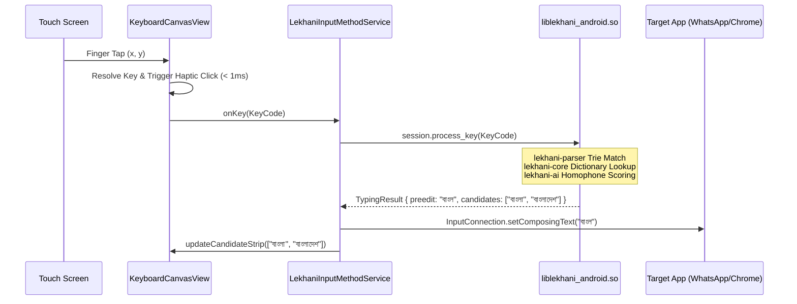

# Lekhani Android: System Architecture & Technical Specifications

## 1. System Overview

Lekhani Android is organized into three distinct tiers:
1. **The Shared Rust Engine** (`lekhani-core`, `lekhani-parser`, `lekhani-ai`).
2. **The FFI Bridge Layer** (Mozilla UniFFI generating JNI bindings and Kotlin classes).
3. **The Android Native Application** (Kotlin, Android `InputMethodService`, Hardware Canvas keyboard view, and Jetpack Compose candidate bar).

```
                      +---------------------------------------+
                      |       Android Application (Kotlin)    |
                      |  - LekhaniInputMethodService          |
                      |  - KeyboardCanvasView (120 Hz)        |
                      |  - ComposeCandidateStrip              |
                      +-------------------+-------------------+
                                          |
                                          | UniFFI Auto-generated
                                          | Kotlin Bindings
                                          v
                      +---------------------------------------+
                      |         liblekhani_android.so         |
                      |  - UniFFI Native C-ABI Bridge         |
                      |  - AndroidLekhaniSession Struct       |
                      +-------------------+-------------------+
                                          |
                      +-------------------+-------------------+
                      |           lekhani-core                |
                      |  - Trie Dictionary, State Machine     |
                      |  - Autocorrect & Morphology           |
                      +---------+-------------------+---------+
                                |                   |
                                v                   v
                      +-------------------+  +-------------------+
                      |  lekhani-parser   |  |    lekhani-ai     |
                      |  - Avro Trie      |  |  - N-gram LM      |
                      |  - 0-alloc Grammar|  |  - Context Scorer |
                      +-------------------+  +-------------------+
```

---

## 2. Low-Latency Key Event Flow

On mobile devices, keystroke latency must stay under **16 ms** (to fit within a single 60 Hz frame) and ideally under **8 ms** (for modern 120 Hz displays).



Total round-trip latency from touch contact to screen update: **< 3 milliseconds**.

---

## 3. Spatial Touch Autocorrect (Gaussian Key Bounding Box)

On mobile keyboards, over 70% of typing mistakes are "adjacent key taps" (e.g. tapping `v` when meaning `b`).
Lekhani Android introduces a spatial touch model:
- For each tap $(x, y)$, calculate the Euclidean distance to the nearest 2 keys:
  $$P(K_i \mid x, y) = \frac{1}{\sigma \sqrt{2\pi}} \exp\left(-\frac{(x - x_{k_i})^2 + (y - y_{k_i})^2}{2\sigma^2}\right)$$
- If the touch is within 25% of a key boundary, both candidate characters are provided to `lekhani-core`'s fuzzy learner.
- The language model (`lekhani-ai`) automatically boosts the grammatically valid word.

---

## 4. Cold-Boot & Memory Constraints

- **Cold Boot Time**: Target **< 40 ms**. Achieved because the Avro grammar Trie is compiled into `.rodata` at build time (no runtime JSON parsing).
- **RSS Budget**: Max **35 MB** heap usage under high memory pressure.
- **Battery Impact**: Zero background CPU wake-locks. When the keyboard is dismissed, all threads sleep.

