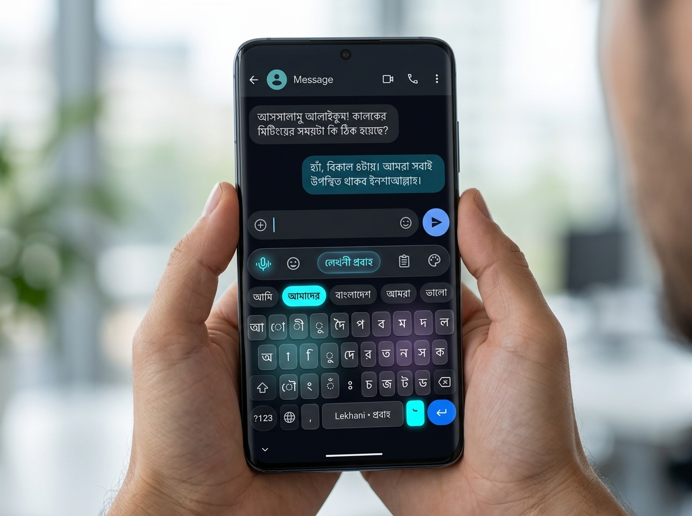
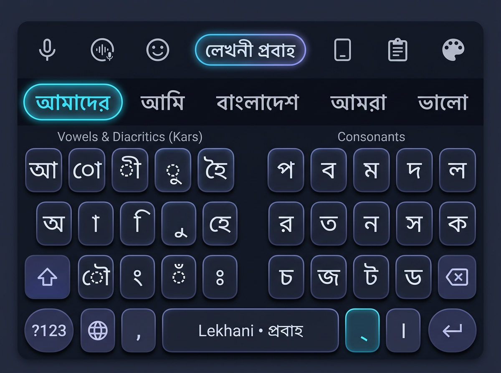
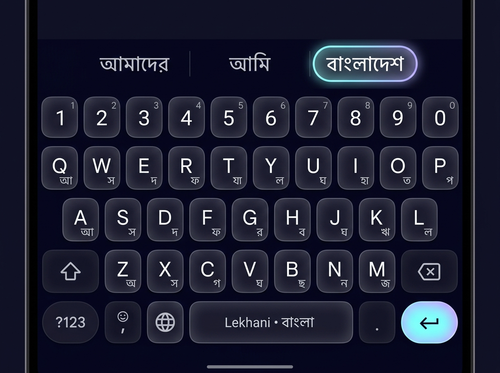
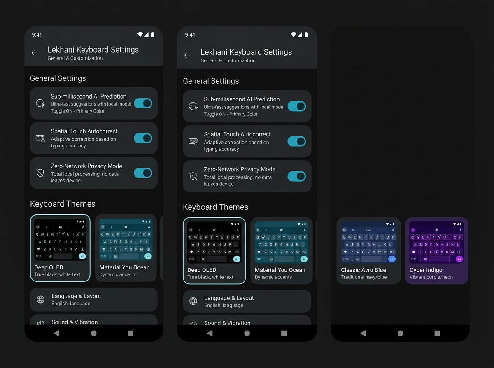

# Lekhani for Android (লেখনী অ্যান্ড্রয়েড)

<p align="center">
  <b>The World-Class, Privacy-First, Sub-Millisecond Bengali Mobile Keyboard</b>
</p>

<p align="center">
  
</p>

<p align="center">
  
  
  
  
</p>

<p align="center">
  <a href="#vision">Vision</a> •
  <a href="#key-features">Features</a> •
  <a href="ARCHITECTURE.md">Architecture</a> •
  <a href="ROADMAP.md">Roadmap</a> •
  <a href="FEATURES.md">Feature Spec</a> •
  <a href="LAYOUT_PROBAHO.md">Lekhani প্রবাহ (Flow)</a> •
  <a href="mockups/index.html">Interactive Mockup</a> •
  <a href="#build-instructions">Build</a> •
  <a href="#author--credits">Credits</a>
</p>

---

## 🌟 The Vision

Lekhani Android is engineered to become the definitive mobile Bengali typing experience across the globe. Built on top of the ultra-fast, zero-allocation Rust [`lekhani-core`](https://crates.io/crates/lekhani-core) and [`lekhani-parser`](https://crates.io/crates/lekhani-parser) engines via Mozilla UniFFI, Lekhani Android combines **uncompromising privacy (100% on-device, 0 network permissions)** with **sub-millisecond keystroke responsiveness**, **contextual AI homophone disambiguation**, and **buttery-smooth 120 FPS hardware-accelerated touch interaction**.

---

## ⚡ Why Lekhani Beats Gboard & Ridmik

| Feature | Google Gboard | Ridmik Keyboard | **Lekhani for Android** |
| :--- | :---: | :---: | :---: |
| **Privacy / Telemetry** | Cloud syncing, telemetry | Proprietary, ad-supported | **100% On-Device, ZERO Internet Permission** |
| **Phonetic Engine** | Proprietary ML (often alters intent) | Outdated grammar rules | **`lekhani-parser` (100% Avro muscle memory)** |
| **Contextual AI Homophones** | Cloud dependent | None | **Sub-microsecond local N-gram model** |
| **Memory Footprint** | ~120 MB | ~80 MB | **< 35 MB (Zero-alloc Rust core)** |
| **Open Source** | ❌ Closed | ❌ Closed | **✅ 100% Free & Open Source (GPL-3.0)** |

---

## 📱 Visual Mockups & UI Showcase

### 1. Flagship Real-World View (Modern Bezel-Less Android 15)


### 2. Lekhani প্রবাহ (Flow) Ergonomic Two-Thumb Layout


### 3. Dark Mode Mobile Keyboard with Contextual Candidate Strip


### 4. Settings & Theme Studio (Material You & OLED Themes)


### 5. Interactive Web Mockup
You can test the interactive prototype directly in your browser by opening [`mockups/index.html`](mockups/index.html).

---

## 🏗️ Technical Architecture at a Glance

```
┌────────────────────────────────────────────────────────┐
│     Android Kotlin Layer (UI & System Input)           │
│  - InputMethodService (Lifecycle & InputConnection)    │
│  - Custom Hardware Canvas (120 FPS Touch Grid)         │
│  - Jetpack Compose Candidate Strip & Material You      │
└──────────────────────────▲─────────────────────────────┘
                           │ UniFFI (Type-safe Kotlin <-> Rust Bridge)
┌──────────────────────────▼─────────────────────────────┐
│     Shared Rust Core (Precompiled via cargo-ndk)       │
│  - lekhani-core: IME state machine & dictionary lookup │
│  - lekhani-parser: 11 ns/char zero-allocation engine   │
│  - lekhani-ai: On-device N-gram model & predictor     │
└────────────────────────────────────────────────────────┘
```

See [ARCHITECTURE.md](ARCHITECTURE.md) for full technical deep-dive.

---

## 🗺️ Project Roadmap

- [x] Phase 0: Standalone Rust Core & Engine Crates published to crates.io
- [x] Phase 1: Native Android UniFFI Bridge Crate (`crates/lekhani-android`)
- [x] Phase 2: Android IME Scaffolding & System Compatibility (Direct Boot, Passwords, WebViews)
- [x] Phase 3: Hardware Canvas Touch Grid & Bengali Script Engine (Avro, Probaho, National, Probhat, Gboard-style)
- [x] Phase 4: Candidate Strip & Contextual AI Intelligence (Homophones, Next-Word, Blacklist)
- [x] Phase 5: 100% Local / On-Device Voice Typing (Offline ASR, Zero Internet)
- [x] Phase 6: Emoji, Kaomoji, Symbols & Clipboard Suite (Unicode 15.1+, Live Search, Persistent Skin Tones)
- [x] Phase 7: Multi-Layout Switcher & Hardware Keyboard (Settings toggles, Bluetooth keyboards)
- [x] Phase 8: Glide / Gesture Typing (Continuous swipe path decoder)
- [x] Phase 9: Dictionary Management & User Data Freedom (Ridmik/Avro import, JSON backup)
- [x] Phase 10: Deep Customization & Theme Studio v2 (Custom theme creator, WCAG contrast checker, 11 presets)
- [x] Phase 11: World-Class Modern UI/UX & Form Factors (Spring physics, tablet split & floating, tool vault)
- [ ] Phase 12: Onboarding Flow, Accessibility & Store Launch (2-step setup, TalkBack, F-Droid & Play)

Detailed task breakdown in [ROADMAP.md](ROADMAP.md).

---

## 🛠️ Build Instructions

### Prerequisites
- **Rust**: 1.78+ with `cargo-ndk` (`cargo install cargo-ndk`)
- **Android NDK**: r25c or r26b (`$ANDROID_NDK_HOME` or standard SDK location)
- **JDK**: OpenJDK 17 or 21
- **Android SDK**: API 34+

### 1. Compile Native Rust Libraries
```bash
# Cross-compiles crates/lekhani-android for arm64-v8a, armeabi-v7a, x86, and x86_64
./scripts/build_rust.sh
```

### 2. Build Android Debug APK
```bash
./gradlew assembleDebug
```
The output APK is generated at:
`android/app/build/outputs/apk/debug/app-debug.apk`

---

## 👤 Author & Credits

- **Architect & Lead Developer**: **Sintaul Mahdi Siam** ([@sintaulsiam](https://github.com/sintaulsiam))
- **Email**: [sintaulsiam@gmail.com](mailto:sintaulsiam@gmail.com)
- **GitHub Repository**: [https://github.com/sintaulsiam/lekhani-android](https://github.com/sintaulsiam/lekhani-android)

---

## 📄 License

Licensed under GPL-3.0-or-later. © 2026 Sintaul Mahdi Siam.
