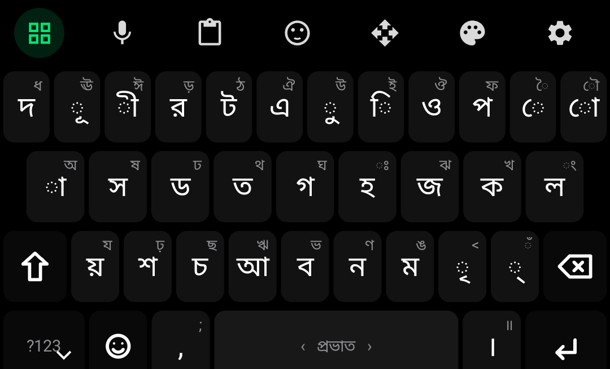
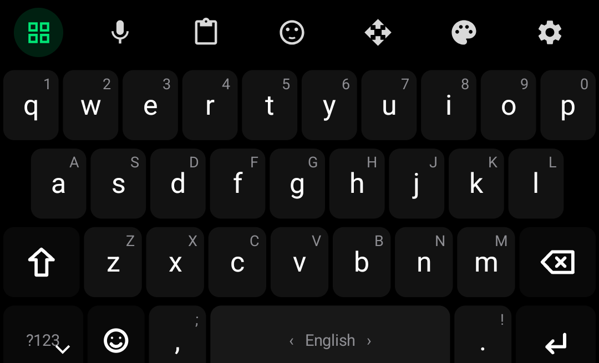
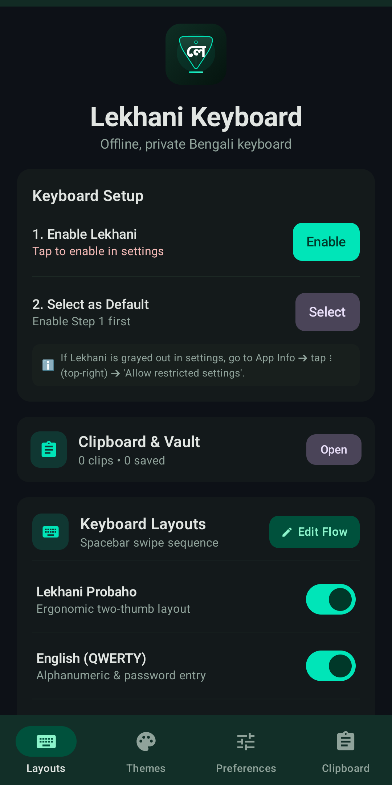
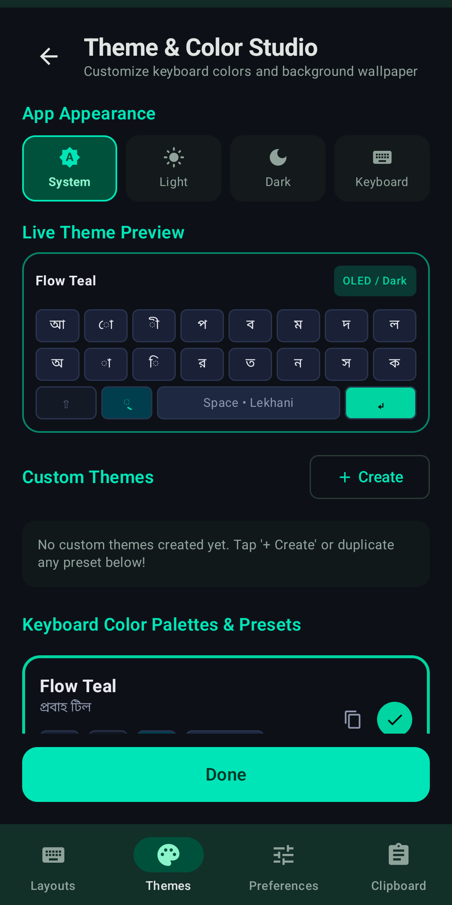
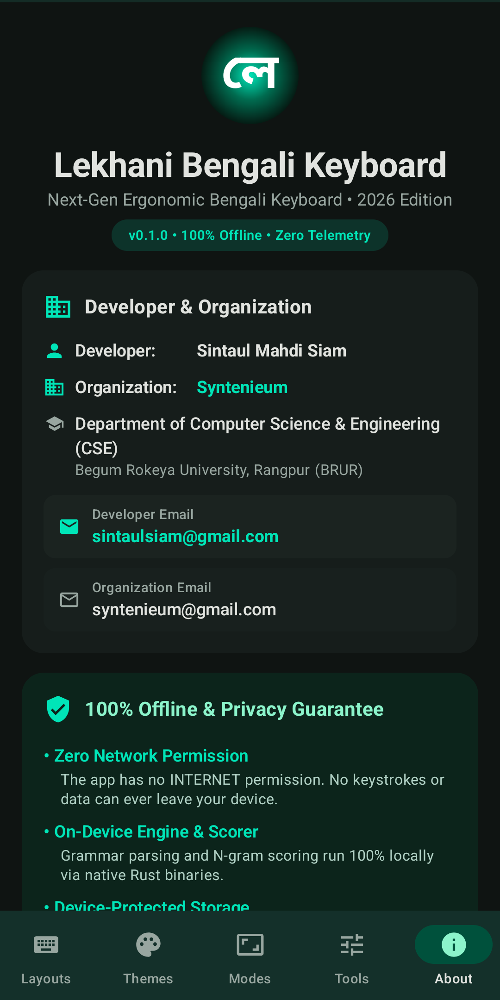

# Lekhani for Android (লেখনী অ্যান্ড্রয়েড)

A fast, offline, privacy-first Bengali keyboard for Android built with Kotlin and Rust.

<p align="center">
  
</p>

<p align="center">
  
  
  
  
</p>

---

## Overview

Lekhani Android provides a responsive, privacy-respecting Bengali typing experience on mobile devices. Text processing, phonetic transliteration, candidate generation, and layout mapping are powered by upstream Rust engines (`lekhani-core`, `lekhani-parser`, `lekhani-ai`) compiled to native libraries via Mozilla UniFFI.

### Key Highlights

- **Zero Network Permissions**: The app does not request `android.permission.INTERNET`. Keystrokes, clipboard snippets, and user dictionary data never leave the device.
- **Native Rust Engine**: Transliteration runs through `lekhani-parser` and `lekhani-core` directly in compiled native code with low latency and zero garbage collection overhead on the typing path.
- **Hardware Canvas Rendering**: `KeyboardCanvasView` draws keys directly on a hardware-accelerated canvas, keeping touch response instantaneous.
- **Bilingual & Multi-Layout**: Switch between phonetic transliteration, ergonomic layouts, fixed BBS standards, and English QWERTY on the fly.
- **Offline Intelligence**: Local N-gram prediction and contextual homophone disambiguation running completely on-device.

---

## Keyboard Layouts

<p align="center">
  
  &nbsp;
  
</p>
<p align="center">
  
  &nbsp;
  
</p>

- **Lekhani প্রবাহ (Flow)**: Custom two-thumb mobile layout designed for Bengali letter frequencies, separating vowels on the left thumb and consonants on the right thumb. See [LAYOUT_PROBAHO.md](LAYOUT_PROBAHO.md).
- **Avro Phonetic**: Standard English-to-Bengali phonetic transliteration matching classic Avro muscle memory.
- **জাতীয় (National)**: Official Bangladesh standard fixed layout with full Shift/AltGr layer support.
- **প্রভাত (Probhat)**: Classic fixed Bengali layout standard with dedicated dead-key combinations.
- **English (QWERTY)**: Alphanumeric layer for seamless bilingual typing and password entry.

---

## Settings & Customization

<p align="center">
  
  &nbsp;
  
  &nbsp;
  
</p>

- **Theme Studio**: Custom color palettes, dark/OLED modes, key borders, and live keyboard preview.
- **Preferences**: Haptic feedback, key press audio, popup hints, spacebar gestures, and layout switcher order.
- **Text Editor / D-Pad**: Dedicated cursor control panel with character/word navigation, text selection toggle, and clipboard actions.
- **Clipboard Vault**: Local, ephemeral clipboard manager with pin support and configurable auto-clear retention.

---

## Technical Architecture

```
┌────────────────────────────────────────────────────────┐
│     Android Native Layer (Kotlin 2.0)                  │
│  - LekhaniInputMethodService (IME Lifecycle)           │
│  - KeyboardCanvasView (Hardware Canvas Drawing)        │
│  - CandidateStripView (Jetpack Compose)                │
│  - Settings & Theme Studio                             │
└──────────────────────────▲─────────────────────────────┘
                           │ UniFFI Auto-Generated Bindings
┌──────────────────────────▼─────────────────────────────┐
│     Native FFI Bridge (Rust / cargo-ndk)               │
│  - crates/lekhani-android (C-ABI / JNI Bridge)         │
│  - AndroidLekhaniSession                               │
└──────────────────────────▲─────────────────────────────┘
                           │ Rust Dependencies
┌──────────────────────────▼─────────────────────────────┐
│     Upstream Engine Crates (Pure Rust)                 │
│  - lekhani-core: Headless IME state machine            │
│  - lekhani-parser: Avro Trie grammar engine            │
│  - lekhani-ai: Local N-gram scorer & ranker            │
└────────────────────────────────────────────────────────┘
```

For detailed component documentation, memory budgets, and threading architecture, see [ARCHITECTURE.md](ARCHITECTURE.md).

---

## Building from Source

### Prerequisites
- **JDK**: OpenJDK 17 or 21
- **Android SDK & NDK**: API 34+ and NDK r25+ (`$ANDROID_NDK_HOME`)
- **Rust**: 1.78+ with `cargo-ndk` (`cargo install cargo-ndk`)

### 1. Build Rust Native Libraries
```bash
# Cross-compiles crates/lekhani-android for arm64-v8a, armeabi-v7a, and x86_64
./scripts/build_rust.sh
```

### 2. Build Android Debug APK
```bash
./gradlew assembleDebug
```

The APK will be generated at:
`android/app/build/outputs/apk/debug/app-debug.apk`

---

## Contributing

Contributions, bug reports, and suggestions are welcome. Please check [CONTRIBUTING.md](CONTRIBUTING.md) for code style, branch workflows, and PR guidelines.

---

## Author

- **Sintaul Mahdi Siam** ([@sintaulsiam](https://github.com/sintaulsiam))
- Email: [sintaulsiam@gmail.com](mailto:sintaulsiam@gmail.com)

---

## License

Licensed under GPL-3.0-or-later. © 2026 Sintaul Mahdi Siam.
